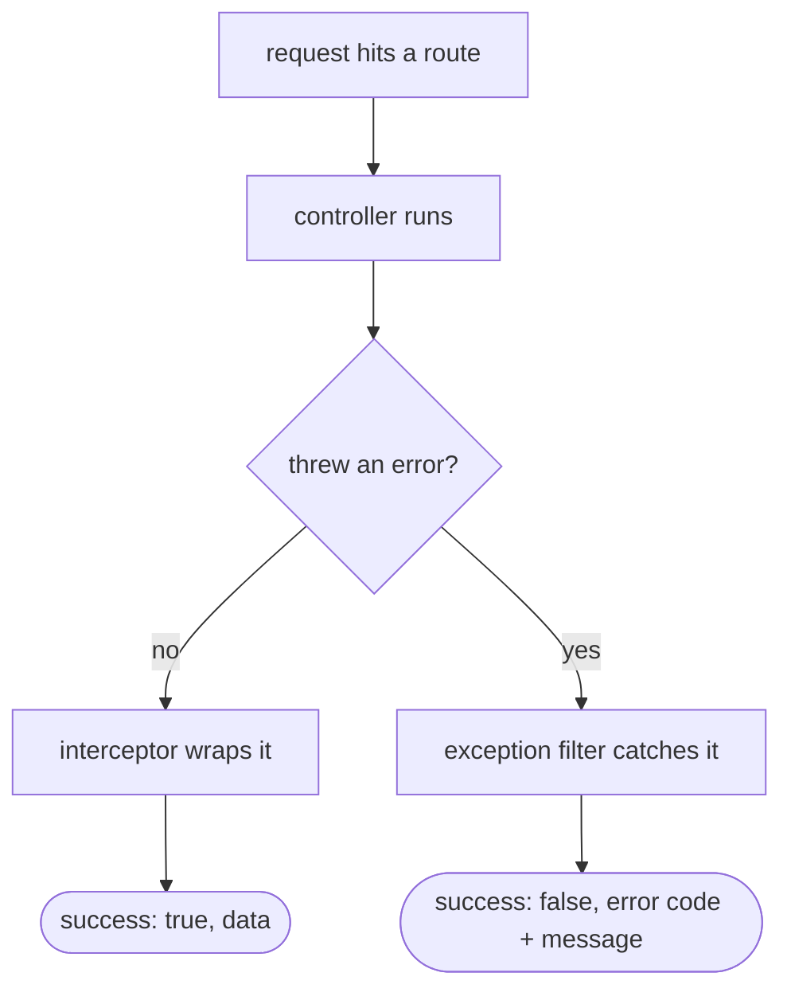

# Shared API conventions

Last updated: 2026-06-26

A few things are the same across every API route so we don't have to think about
them per endpoint: the response shape, error handling, and a startup check for the
environment. They live in `packages/api/src/common/` and `packages/api/src/config/`
and are wired in globally when the app boots.

## Every successful response has the same shape

We wrap every successful response in the same envelope so the web and mobile clients
always know what to expect:

```json
{ "success": true, "data": <the actual thing> }
```

That wrapping is done by `TransformResponseInterceptor` in
`common/interceptors/transform-response.interceptor.ts`. It is a tiny interceptor: a
route just returns its data (a stock item, a list, whatever) and the interceptor maps
it into `{ success: true, data }`. So no controller has to remember to do it.

## Every error has the same shape too

Errors get a matching envelope, handled by `HttpExceptionFilter` in
`common/filters/http-exception.filter.ts`:

```json
{ "success": false, "error": { "code": "NOT_FOUND", "message": "..." } }
```

The `code` is the HTTP status name (`NOT_FOUND`, `BAD_REQUEST`, and so on). A couple
of details worth calling out:

- For a normal `HttpException` (the ones we throw on purpose, like
  `NotFoundException`) it uses the real status and message. It also flattens the case
  where the validation pipe hands back an array of messages, joining them into one
  string.
- For anything unexpected (a bug, a thrown non-HTTP error) it returns a plain
  500 / `INTERNAL_ERROR` with a generic message, and logs the real stack on the
  server only. That way we never leak a stack trace or an internal detail to the
  client, which is good for both security and privacy.

So the client can always check `success` and, on failure, switch on `error.code`,
and it works the same for every route.



## Env vars are checked at startup

The app needs certain secrets and URLs to do anything useful (the JWT secrets, the
database URL, the Mistral key, the R2 credentials). If one of those is missing we
would rather the app refuse to start than boot and then explode on the first request.

So `config/env.validation.ts` defines a Zod schema for the env and a `validateEnv`
function. We pass it to Nest's `ConfigModule.forRoot({ validate })`, so on boot it
checks everything. If a required value is missing it throws with a readable list of
exactly what is wrong. Redis host and port have sensible local defaults so we don't
have to set them in development.

## Plus the usual per-route rules

On top of the global stuff, each endpoint follows the same checklist: DTO validation
with class-validator, an auth guard where the route needs a logged-in user, and
Swagger decorators so the route shows up in the generated API docs. The live Swagger
page is the source of truth for the API surface, and there is a written summary in
[api.md](../api.md).
