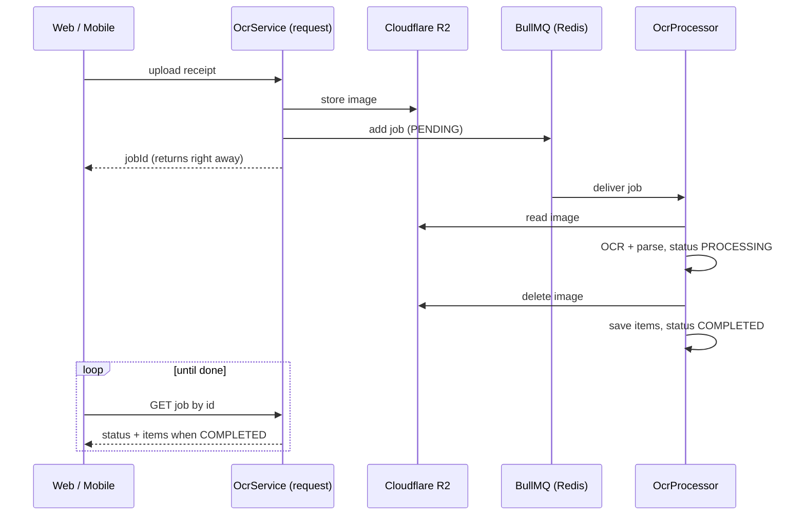
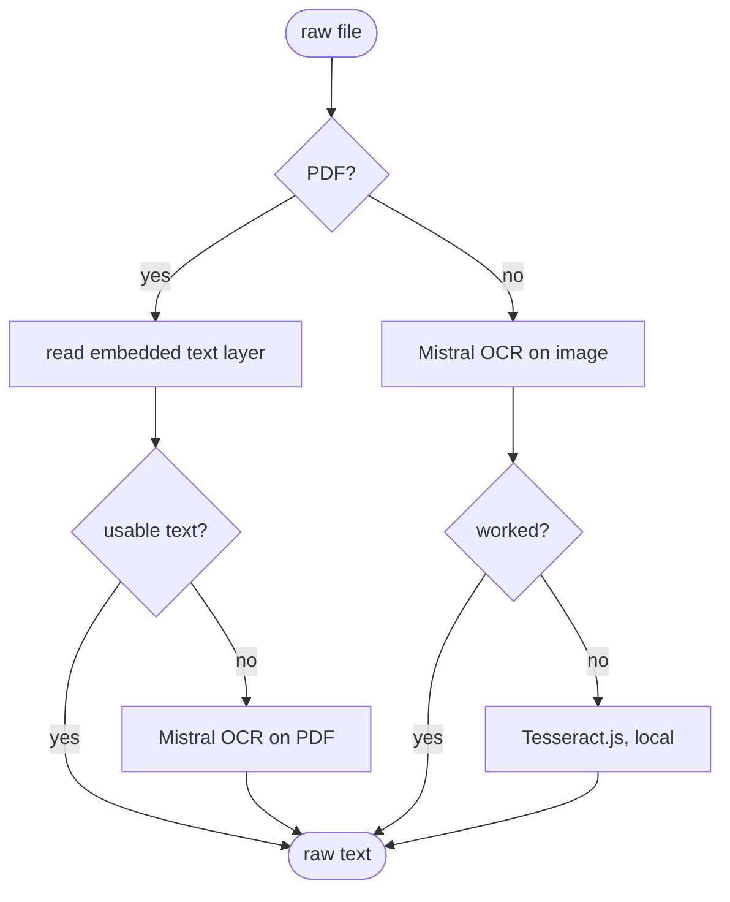

# How scanning a receipt works (and why it runs on a queue)

Last updated: 2026-06-26

## The problem

Reading a receipt is slow. We send the image to Mistral OCR, wait for the text,
parse it, maybe fall back to a second OCR engine, then write everything to the
database. That can take several seconds. If we did all of that inside the HTTP
request, the phone or browser would just sit there spinning, and if the upload
timed out we would lose the work halfway through.

So we don't do it in the request. The upload route does the tiny fast part and
hands the slow part off to a background worker.

## How it works

The code is split in two:

- `packages/api/src/ocr/ocr.service.ts` runs inside the request. It creates an
  `OcrJob` row with status `PENDING`, uploads the image to R2, and pushes a job onto
  a BullMQ queue called `ocr`. Then it returns a `jobId` straight away.
- `packages/api/src/ocr/ocr.processor.ts` is the worker. It picks the job off the
  queue, does the slow OCR and parsing, writes the result back onto the `OcrJob`
  row, and flips the status to `COMPLETED` (or `FAILED`).

BullMQ is backed by Redis, so the queue survives a restart. The client side polls
the job by its id (`GET` the job) and watches the status go `PENDING` to
`PROCESSING` to `COMPLETED`, then reads the parsed items off it.

The processor runs with `concurrency: 3`, so at most three receipts get processed
at once and the rest wait their turn. That keeps one big batch of uploads from
eating all the memory.

Here is the whole round trip, from the upload to the client reading the items back:

### The OCR fallbacks

We try the cheaper, more accurate option first and fall back when it fails:

- For a PDF we first read the embedded text layer (digital receipts already contain
  exact text, so OCR would only add mistakes). Only if there is no usable text layer
  do we send the PDF to Mistral OCR.
- For a photo we try Mistral OCR first. If that throws (network, quota, whatever) we
  fall back to Tesseract.js, which runs locally so it always works even offline.

Once we have raw text we hand it to the parsers (see
[receipt-parsers.md](./receipt-parsers.md)).

### Retries and cleanup

The job is queued with `attempts: 3` and an exponential backoff, so a brief Mistral
or network blip retries on its own instead of failing the whole scan. We only mark
the job `FAILED` once the last attempt is used up.

As soon as a job finishes (success or final failure) the worker deletes the receipt
image from R2. That is an RGPD thing and it is covered in
[data-privacy.md](./data-privacy.md).

## Why the worker can run on its own

There is a second entrypoint at `packages/api/src/worker.ts`. It boots the same
NestJS app but without the HTTP server, just enough to run the queue processor and
the scheduled jobs. The idea is that one day the OCR work can run in its own
container, separate from the API, so a pile of receipts doesn't slow down normal
requests.

Right now we run everything in one process, and the API app already runs the
processor, so we run either the API or this worker, not both at the same time (if
both ran, both would pull from the same queue and each job would get done twice).
Splitting them for real is tracked as a known divergence (D2) in
[CONCEPTION_DIVERGENCES.md](../CONCEPTION_DIVERGENCES.md).

## What we considered instead

Doing the OCR straight inside the upload request. It was simpler to write but the
request would hang for seconds and a timeout would lose the work. The queue means
the upload returns instantly and a slow or flaky OCR call can retry without the user
noticing. For setting up Mistral itself see [mistral-setup.md](../mistral-setup.md).
