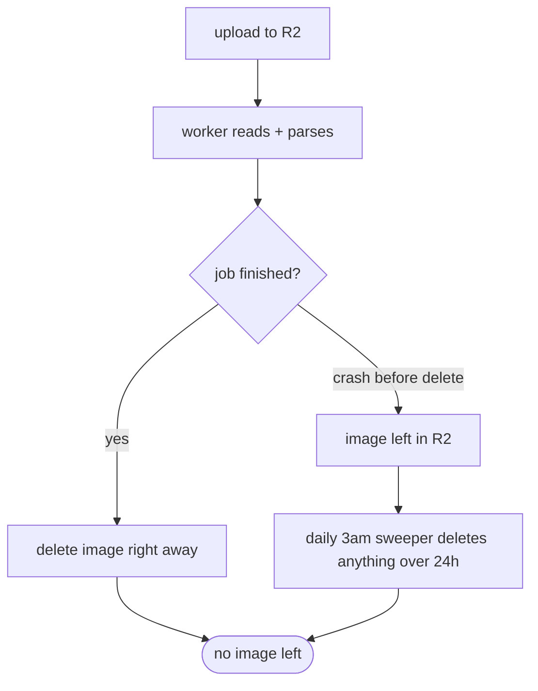

# Privacy and RGPD decisions

Last updated: 2026-06-26

PantryAI handles food consumption data and receipt photos, which both feel personal,
so we tried to take RGPD seriously from the start rather than bolting it on later.
Here are the main calls we made.

## Receipt images are ephemeral

We never want to be the place that hoards photos of people's shopping. So a receipt
image only exists in storage for as long as it takes to read it.

The flow is in [async-ocr-pipeline.md](./async-ocr-pipeline.md), but the privacy part
is: the upload route puts the image in Cloudflare R2, the worker reads it, and the
moment the job finishes (whether it worked or failed for good) the worker deletes the
image from R2. We also throw away the raw OCR text after parsing, we only keep the
clean list of items.

### The 24h sweeper as a safety net

Deleting on success is the normal path, but what if the app crashes after uploading
and before deleting? Then an image is stuck in R2 forever, which is exactly what we
were trying to avoid. So we have a backstop in
`packages/api/src/storage/r2-sweeper.service.ts`. It runs once a day (a cron at 3am)
and deletes any receipt image older than 24 hours, then nulls out the `imageKey` on
the matching job row so the database does not point at a file that is gone.

So even in the worst case no receipt image lives past a day. For how R2 is wired up
see [r2-setup.md](../r2-setup.md).

## We use an EU OCR provider on purpose

For OCR we use Mistral (a French company) as the primary, with Tesseract.js running
locally as the fallback. We deliberately did not use Google Vision or AWS Textract.
The reason is data sovereignty: sending receipt images to a US cloud OCR service
brings in Cloud Act risk, and we would rather keep that data in the EU. Tesseract
running on our own machine is about as private as it gets since the image never
leaves the server.

## Exporting a user's data (Article 20)

A logged-in user can pull everything we hold about them. The route is
`GET /users/me/export` (`packages/api/src/users/users.service.ts`). It returns the
profile, the stock items, and the OCR job metadata as one JSON object. It does not
include receipt images (those are long gone) or the raw OCR text, only the parsed
metadata. The reads go through our per-user scoped Prisma client, so an export can
only ever contain that one user's rows. That scoping trick is explained in
[prisma-setup.md](./prisma-setup.md).

## Deleting an account (Article 17)

A user can also delete their account: `DELETE /auth/me`, which calls `deleteAccount`
in `packages/api/src/auth/auth.service.ts`. It removes any receipt images still in
R2, then anonymises and soft-deletes the user (it sets `deletedAt`, blanks the name,
and rewrites the email to a throwaway `deleted-...@anonymized.invalid` value so the
real one is gone but the unique constraint is still happy). Every login check also
treats a row with `deletedAt` set as "not found", so a deleted account cannot be used
again.

We soft-delete rather than hard-delete partly because the waste history (the
`deletedAt` timestamps on stock items) is the event log the Waste Level score is
built on, so a hard cascade would be more complicated. The disposition lives on the
existing soft-delete column instead of a new table, which is written up as a
divergence in [CONCEPTION_DIVERGENCES.md](../CONCEPTION_DIVERGENCES.md).

## We try not to log personal data

We avoid logging emails, names, or what people eat. When the global error handler
hits an unexpected error it logs the stack on the server but only sends the user a
generic message, so nothing sensitive leaks out in an API response. That handler is
described in [api-conventions.md](./api-conventions.md).
