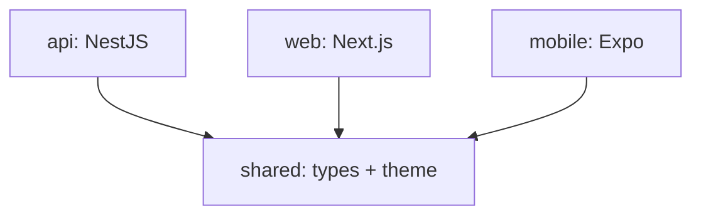

# Why we use a monorepo

Last updated: 2026-06-26

## What it is

Everything we build lives in one git repo. Inside it there are four packages under
`packages/`:

- `web` - the Next.js website
- `mobile` - the Expo / React Native app
- `api` - the NestJS backend
- `shared` - plain TypeScript types and helpers the other three import

We use pnpm workspaces to link them together and Turborepo to run scripts across
all of them. The workspace is set up in `pnpm-workspace.yaml` (it just points at
`packages/*`) and the tasks live in `turbo.json`.

All three apps depend on `shared`, and `shared` depends on nobody. That one-way
arrow is the whole reason the build order below matters.

## How it works

The root `package.json` has scripts like `build`, `lint`, `typecheck`, and `test`
that all call `turbo run <thing>`. Turborepo then runs that thing in every package
that has it, in the right order, and caches the result so a second run is fast.

The ordering matters because of `shared`. In `turbo.json` we say `build` depends on
`^build`, which means "build everything I depend on first". So `shared` gets built
before `api`, `web`, and `mobile`, because those three import from it. If we changed
a type in `shared` and forgot to rebuild, the others would be using the old types,
so letting Turborepo handle the order saves us from that.

## Why we did it this way

The web app and the mobile app need the exact same types as the api (a `StockItem`
is a `StockItem` everywhere). If we had three separate repos we would either copy
those types around by hand and watch them drift apart, or publish `shared` to a
registry and bump versions every time we changed a field. Both sounded annoying for
a solo project. One repo means we change a type once and everyone sees it on the
next build.

It also means one `pnpm install`, one lint config, one test command. We can open a
single editor window and jump from a button on the web app to the api route it calls
to the shared type they both use, without switching projects.

## What we considered instead

Separate repos per app. We decided against it because of the type-sharing pain
above. The tradeoff is that the repo is bigger and a fresh clone installs
everything at once, but for one developer that is fine.

More detail on what each package is responsible for is spread across the other
files in this folder.
