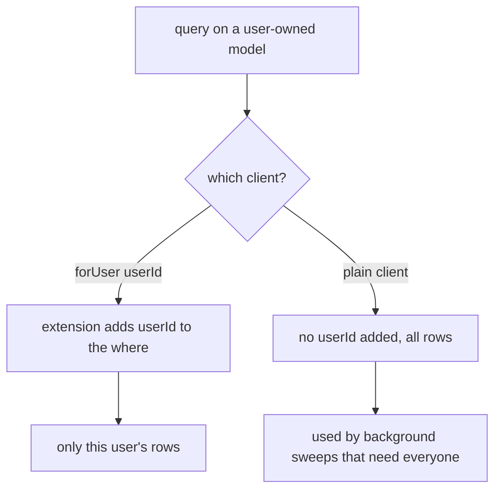

# Why Prisma 7 is set up the way it is

Last updated: 2026-06-26

Prisma is the only thing that talks to the database in this project. We never write
raw SQL and we never use another ORM. A few things about our setup look a little
different from an older Prisma tutorial, so here is why.

## The Rust-free client generated into our source tree

In `packages/api/prisma/schema.prisma` the generator looks like this:

```prisma
generator client {
  provider = "prisma-client"
  output   = "../src/generated/prisma"
}
```

Two things to notice:

- The provider is `prisma-client`, not the older `prisma-client-js`. This is the
  newer TypeScript client that does not ship a Rust query engine binary. Less native
  stuff to install means fewer "it works on my machine" problems, which is nice on a
  small project.
- The `output` points into our own `src/generated/prisma` folder, not into
  `node_modules`. So the generated client is real files we can see and import
  normally. Because the generated code uses ESM, we import from it with `.js`
  extensions even though the source is TypeScript (for example
  `from '../generated/prisma/client.js'`).

Because the client is Rust-free, it needs a driver adapter to actually reach
Postgres. We use `@prisma/adapter-pg` on top of the `pg` connection pool. That wiring
is in `packages/api/src/prisma/prisma.service.ts`: we make a `pg` `Pool` from the
database URL, wrap it in `PrismaPg`, and hand that adapter to `PrismaClient`.

The `PrismaService` is a normal NestJS injectable. It connects on
`onModuleInit` and closes the pool on `onModuleDestroy`, so the app opens and shuts
the database cleanly with the rest of the lifecycle.

## The per-user scoped client

This is the part worth understanding. On top of the normal client we have a helper
called `forUser(userId)`. It returns a Prisma client (built with `$extends`) that
automatically adds `userId` to the `where` of every read and write on a user-owned
model.

The list of user-owned models is right there in the file: `StockItem`, `OcrJob`,
`ShoppingItem`, `UserDevice`, `UserXp`, `UserChallenge`. Shared tables like `Product`
and `Recipe` are not in the list and are left alone.

Why bother? It is a safety net for data isolation. We do not use database row-level
security here, isolation is done in the app by filtering on `userId`. The risk with
that approach is one forgotten `where: { userId }` leaking another user's data. With
`forUser`, even if a query forgets the filter, the extension adds it, so the query
still can only touch that user's rows. We use it on per-user routes like the RGPD
export.

Background jobs that genuinely need to see every user (the expiration notification
sweep, the R2 sweeper) just use the plain client instead.



## Why not row-level security?

The original plan mentioned Supabase RLS, but we ended up using Supabase only as the
Postgres host and doing auth and isolation in the app. So instead of RLS policies in
the database we get the same "a user only sees their own rows" guarantee from the
`forUser` extension. That difference is one of the entries in
[CONCEPTION_DIVERGENCES.md](../CONCEPTION_DIVERGENCES.md), and how login itself works
is in [AUTHENTICATION.md](../AUTHENTICATION.md).
