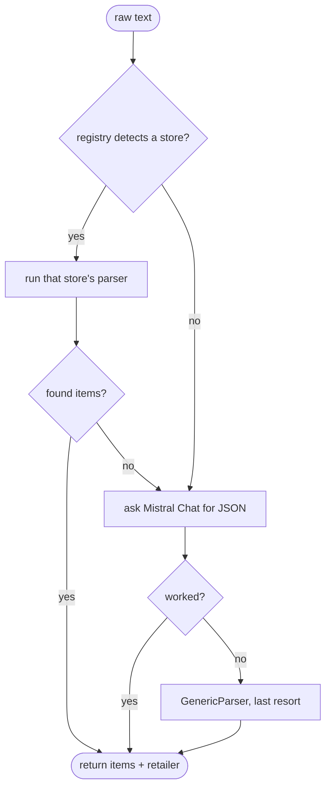

# How we turn receipt text into a product list

Last updated: 2026-06-26

## The problem

Once OCR gives us the raw text of a receipt, we still have to pull out the actual
products. The trouble is every French supermarket lays its receipt out differently.
Carrefour, Leclerc, Auchan, Lidl, and Grand Frais all put the store name, the prices,
the quantities, and the weird discount lines in different places. One big
if/else covering all of them would be a nightmare to read and to test.

## How it works

We give each retailer its own small parser, and they all follow the same shape. The
shape is the `ReceiptParser` interface in
`packages/api/src/ocr/parsers/receipt-parser.interface.ts`:

```ts
interface ReceiptParser {
  readonly retailerName: string;
  parse(rawText: string): ParsedReceiptItem[];
}
```

So a parser just knows its store name and knows how to turn raw text into a list of
items. Each store gets a file: `carrefour.parser.ts`, `leclerc.parser.ts`,
`auchan.parser.ts`, `lidl.parser.ts`, `grand-frais.parser.ts`. There is also a
`generic.parser.ts` for when we have no idea which store it is.

Picking the right one is the job of `parser-registry.ts`. It looks at the text and
matches on the brand name, mostly in the first 20 lines because that is where the
store name usually sits in the header:

```ts
if (/CARREFOUR/i.test(header)) return new CarrefourParser();
if (/E\.LECLERC|LECLERC/i.test(header)) return new LeclercParser();
...
```

A couple of stores need special handling. Grand Frais often prints its name in the
footer instead of the header, so we search the whole text for it, and Lidl digital
receipts do the same, so we also look for "Ticket de vente". If nothing matches, the
registry returns `null`.

### What happens when a parser is not enough

The worker (`ocr.processor.ts`, function `parseReceiptText`) ties it together and is
careful not to give up too early:

1. Ask the registry to detect a parser. If one matches and it finds at least one
   item, great, we use it.
2. If we recognised the store but its parser found nothing (the layout changed, OCR
   was messy), we do not return an empty list. We fall through.
3. The fallback is Mistral Chat with a small prompt that asks for the products as
   JSON. We still remember which store we detected and keep that as the retailer.
4. If even Mistral Chat fails, we use the `GenericParser` as a last resort so we
   always return something.

So the order is: store-specific parser, then a general AI parse, then a dumb generic
parse. Each step is a safety net for the one before it.



## Why we did it this way

Two reasons. First, adding a new supermarket is easy and low-risk: we write one new
file that implements the interface and add one line to the registry, and we never
touch the others. Second, each parser is tiny and pure (text in, items out), so it
is easy to test. We have a spec file per parser under `parsers/__tests__/` with real
receipt samples, and a test for the registry's detection logic.

## What we considered instead

One giant parser with a big switch inside. It would have all the store quirks
tangled together, so a fix for Lidl could quietly break Carrefour, and testing one
store would mean dragging in all of them. Splitting them keeps each store's mess in
its own box.
