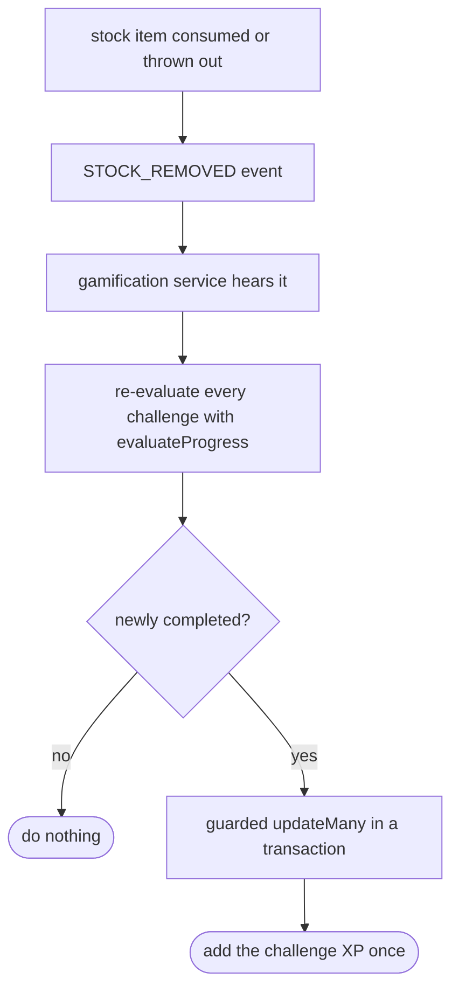

# Waste Level and the Trashy challenges

Last updated: 2026-07-11

This covers the two "fun" mechanics: the Waste Level score with the Trashy mascot
mood, and the challenge loop that hands out XP. We kept the actual maths in small
pure functions on purpose so they are easy to test and easy to explain.

## Waste Level

The idea is one number from 0 to 100 that says how little food a user is wasting, and
a mascot mood that goes with it. The formula lives in
`packages/api/src/waste/waste-scoring.ts`.

Every stock item ends up in one of three outcomes: it gets `CONSUMED` (good),
`DISCARDED` (thrown out), or `EXPIRED` (went off). Discarded and expired both count
as waste, only consumed is the good outcome.

Since 2026-07-11 the score mixes two parts:

```
score = round(0.7 * outcome + 0.3 * pantry)
```

**The outcome part (70%)** is what happened over a rolling 30-day window
(`WASTE_WINDOW_DAYS`), recency weighted. Each item counts less the older it is,
with a 14 day half life (`WASTE_HALF_LIFE_DAYS`): an item resolved today has
weight 1, two weeks ago 0.5, four weeks ago 0.25. On top of that, a "rescue"
(an item eaten with 3 days or less left before its expiry date,
`RESCUE_WINDOW_DAYS`) counts 1.5x (`RESCUE_BONUS`), because saving food that was
about to go off is the behaviour we most want to reward.

```
weight  = 0.5 ^ (ageDays / 14) * (1.5 if rescue)
outcome = 100 * sum(weights of consumed) / sum(weights of all)
```

The recency decay is there because with a plain ratio, one bad week of tossing
food locked the mascot into a sad mood for a whole month, and then the waste fell
off a cliff on day 30. With the decay, old waste fades gradually and using items
today visibly lifts the mood within days.

**The pantry part (30%)** is the fridge right now, so an eating spree cannot hide
food that is dying in stock. Each item currently in stock that is already expired
counts as 1 risk, each item expiring within 3 days counts as 0.5
(`PANTRY_SOON_RISK`):

```
pantry = 100 * max(0, 1 - (expired + 0.5 * expiringSoon) / itemsInStock)
```

An empty pantry scores 100 (nothing to worry about is not a problem). The raw
counts we show in the UI ("5 used, 2 thrown out") stay unweighted, only the score
mixes and weighs things.

One deliberate choice: if there is nothing resolved yet and nothing is at risk (a
brand new user), the score is 100, not 0. We did not want to greet someone with a
guilt-trip before they have even used the app, so an empty history starts on the
best mood.

The mood bands live in the shared package (`wasteMoodBands` in
`packages/shared/src/types/waste.ts`): 90+ is EXCELLENT, 70+ GOOD, 50+ OKAY, 30+ BAD,
below 30 AWFUL. `moodFromScore` in the api reads those same bands, and so do the
progress bars in the apps, so the backend and the front ends can never disagree on
the thresholds (see [shared-types.md](./shared-types.md)).

Besides the score and mood, `GET /waste/level` also returns a few derived fields the
mood screens use, all computed in the same pure `waste-scoring.ts` functions:

- `nextMood` + `itemsToNextMood`: how many more consumed items would push the score
  into the next band up ("use ~3 more items and Trashy feels Good"). We solve it in
  closed form on the server because the client cannot re-derive the weighted sums
  from the counts alone. Null when the user is already on EXCELLENT. Eating only
  moves the outcome part, so when the pantry drags too hard the next band can be
  unreachable that way: then `itemsToNextMood` is null and `pantryBlocked` is true,
  and the apps show "sort out the expiring items first" instead.
- `pantry`: the in-stock totals behind the pantry part (total, expired,
  expiringSoon, score) so the UI can explain the drag.
- `rescuedCount`: how many consumed items in the window were rescues, shown in the
  "items used" detail sheet.
- `trend`: IMPROVING, STEADY or WORSENING, comparing the plain score of the last 7
  days against days 8 to 30, with a 5 point dead zone so tiny differences read as
  steady. Null until both sides have at least one item, because comparing against an
  empty week would mean comparing against a made-up 100.
- `weeklyScores`: the plain score for each of the last 4 weeks, oldest first, so the
  apps can draw the little history bars. A week with no items is null, never a fake
  perfect score. (The window is 30 days but 4 weeks is 28, so items aged 28 to 30
  days count in the score but not in any bar.)

Note: the trend, the weekly bars and the monthly history are outcome-only plain
ratios. The pantry part is "now", it has no history to bucket.

Two companion endpoints feed the detail UI:

- `GET /waste/items`: the resolved items behind the counts (newest first, max 200),
  each with its disposition, dates, rescue flag and per-item CO2 estimate, plus the
  CO2 factor table so the apps can show how the estimate is calculated. The mobile
  stat cards open a bottom sheet with this, the web counts open a dialog.
- `GET /waste/history`: the all-time view, one entry per UTC calendar month from the
  first resolved item to now (capped at 24 months, `HISTORY_MONTHS_CAP`), empty
  months as nulls. Computed live from the soft-deleted rows, no extra table: those
  rows are never pruned, so the history is already sitting in the database.

The original conception named a "Waste Level" but never defined the formula, so this
is one of the places we filled in a blank, written up in
[CONCEPTION_DIVERGENCES.md](../CONCEPTION_DIVERGENCES.md).

## Challenges and XP

Challenges are small weekly goals like "eat 10 items this week" or "no waste this
week". Each one is worth some XP and pays out once per week: on Monday everything
resets and the XP can be earned again. The user has a single running XP total that
never resets.

The pieces:

- `gamification/challenges.ts` has the list of challenge definitions (`CHALLENGE_DEFS`),
  each with a `key`, some text, an `xp` value, and a `rule`.
- `gamification/challenge-rules.ts` has `evaluateProgress`, a pure function that takes
  a rule plus some pre-counted `signals` and returns `{ progress, target }`. There are
  no database calls in here, which is exactly why it is easy to unit test.
- `gamification/gamification.service.ts` does the database side: it loads the signals,
  calls `evaluateProgress`, and awards XP.
- `gamification/week.ts` has the day and week helpers. Days and weeks follow the
  Paris clock no matter where the server runs, since that is where our users are.
- `gamification/streak.ts` has `computeStreak`, another pure function (see below).

### How a rule is scored

`evaluateProgress` handles three kinds of rule:

- `consume_count`: how many items the user has eaten, optionally only counting one
  location (like the fridge). Progress is capped at the target.
- `no_waste_window`: count items consumed in a window, but if anything at all was
  wasted in that window, progress drops back to 0, because the clean streak is broken.
- `shopping_checked`: how many shopping-list items the user has ticked off.

### The weekly reset

Progress is stored per user, per challenge and per ISO week: the `UserChallenge` row
carries a `weekKey` like `2026-W28` and the unique key is
`(userId, challengeId, weekKey)`. When we recheck, we only count signals from the
start of the current Paris week (consumptions by their `deletedAt`, shopping ticks by
a `checkedAt` stamp the shopping list writes when an item is ticked). So on Monday a
fresh row starts at 0 for everyone and last week's rows just stay behind as history.
Rows from before challenges became weekly have an empty `weekKey` and are left alone.

### When it runs and how XP is only paid once per week

The recheck is event-driven. When a stock item gets used up or thrown out, the stock
module emits a `STOCK_REMOVED` event, and the gamification service listens for it
(`@OnEvent`) and re-evaluates the challenges for that user. So we only do the work
when something actually changed, instead of recomputing all the time.

To make sure a challenge's XP is only added once per week, the award uses a guarded
`updateMany` inside a transaction on the current week's row: it only flips the row to
done if it was not already done, and only the call that actually changes a row goes
on to add the XP. If two events fire at nearly the same time, only one of them wins,
so the XP can't be double-counted.



The challenge definitions are seeded into the database on startup (`onModuleInit`
upserts them by `key`), because we do not have a separate Prisma seed script. Running
it again just updates the existing rows instead of creating duplicates.

## Lessons and the daily streak

The Learn tab turns the conservation tips into small interactive lessons. Opening a
lesson shows a one-question quiz about the tip; answering it (right or wrong) or
confirming a quiz-less lesson completes it and pays 20 XP, once per lesson. The
completion lives in `lesson_completions`, whose primary key `(userId, tipId)` is the
guard against paying twice.

The quiz itself is not hand-written, but it is not made at runtime either. It sits in
the data files next to the tips (`src/learning/data/tips.fr.json` and `tips.en.json`,
each tip has a `quiz` field). A one-off script, `scripts/generate-lessons.ts`, is what
fills those in: it asks Mistral (the same EU provider we already use for OCR, so no
new RGPD worry; the tips are public content, no user data is sent) for one question
per tip and, for English, a translation of the tip too, then writes the result
straight into the JSON. You run it once with `pnpm --filter @pantryai/api
generate-lessons` and commit the files. So the running app never calls Mistral, every
lesson is ready instantly, and we never pay for the same quiz twice. The check that a
quiz is well formed lives in `src/learning/quiz.ts` so the script and the tests share
it. If a tip has no quiz yet (or a translation is missing), the lesson still opens: it
falls back to a plain read-and-confirm card, and English falls back to the French
text, so nothing is ever blank.

The daily streak is how many days in a row the user did something anti-waste: at
least one finished lesson or one consumed stock item that day (Paris days). Nothing
is stored for it; `computeStreak` in `gamification/streak.ts` recomputes it from the
completion and consumption timestamps on every read. A run that ended yesterday
still counts today, so the flame does not drop to zero first thing in the morning,
and the response says whether today has counted yet so the app can show the flame
lit or dim.

XP also maps to levels now. The thresholds and the `getLevel` helper live in the
shared package (`gamification/levels.ts`) so mobile and web show the same "Level 2,
Food Saver" everywhere; the level titles come from the i18n catalogs.
